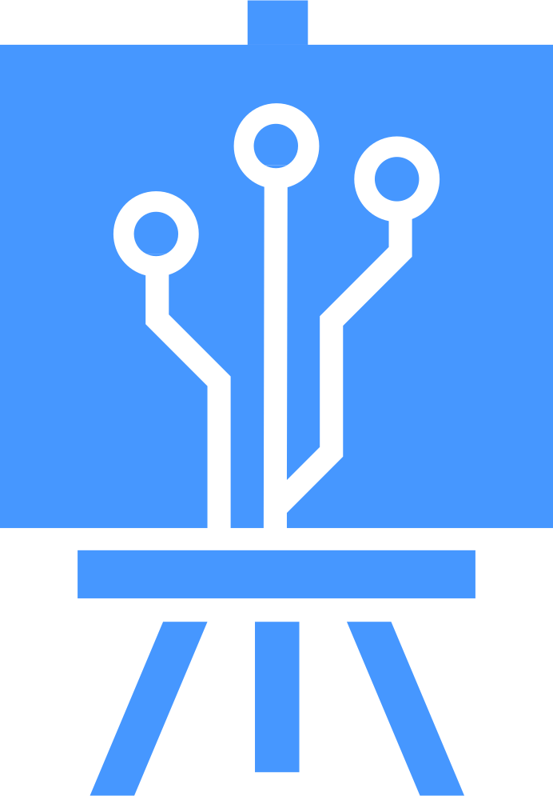

<a name="readme-top"></a>

<div align="center">
  <a href="https://nano-canvas-kappa.vercel.app/" target="_blank" rel="noreferrer">
    
  </a>
  <h1>🎨 Nano Canvas</h1>
  <p align="center">
    Infinite visual workspaces for AI vision models — drag images, craft prompts, and explore results in one canvas.
  </p>

  <p align="center">
    <a href="#-features">Features</a>
    ·
    <a href="#-getting-started">Getting Started</a>
    ·
    <a href="#-architecture">Architecture</a>
    ·
    <a href="#-roadmap">Roadmap</a>
    ·
    <a href="#-community">Community</a>
  </p>

  <p>
    <a href="https://pnpm.io"></a>
    <a href="https://vitejs.dev"></a>
    <a href="https://react.dev"></a>
    <a href="https://tailwindcss.com"></a>
    <a href="https://vitest.dev"></a>
  </p>
</div>

---

> Nano Canvas lets you explore vision LLM workflows visually: upload reference images, link prompts, and ship creative pipelines with instant feedback.

> **Note:** This is my first open-source release. If you spot something that could be clearer, more secure, or easier to use, please jump in—helping the project grow together is the priority.

## ✨ Features

| Experience | AI Workflow | Polish |
| --- | --- | --- |
| 🌀 Infinite pan/zoom canvas | 🤖 Google Gemini integration with resilience | 🎯 Guided drag-to-connect interactions |
| 📷 Drag & drop or paste images | 🧠 Prompt nodes with scale controls & history | ♿ Focus-trapped modals + keyboard navigation |
| 🔁 Auto-spawn linked nodes during connections | 🔐 Local storage persistence | ☁️ CSP hardened, production-ready setup |

## 🚀 Getting Started

<details>
<summary><strong>Prerequisites</strong></summary>

- Node.js ≥ 18
- pnpm (recommended) — or npm/yarn

</details>

```bash
# Clone the repo
git clone https://github.com/AUT-Valunex/nano-canvas.git
cd nano-canvas

# Install dependencies
pnpm install

# Start the dev server
pnpm dev
```

Visit <http://localhost:5173> or hop onto the hosted preview at [nano-canvas-kappa.vercel.app](https://nano-canvas-kappa.vercel.app/) and click the ⚙️ settings icon to drop in your Google AI API key (get one from [AI Studio](https://makersuite.google.com/app/apikey)).

### 🧪 Quality Checklist

```bash
pnpm lint    # ESLint with zero-warning policy
pnpm test    # Vitest suites (stores, hooks, components)
pnpm format  # Prettier formatting (optional)
```

## 🧑‍💻 Development

```bash
pnpm install        # install dependencies
pnpm lint           # enforce ESLint zero-warning policy
pnpm test           # run the Vitest suite (jsdom environment)
pnpm build          # type-check and build production artifacts
```

During local testing, add your Google AI API key via the in-app settings modal; the OSS build ships without analytics, so nothing is sent to third parties unless you add it in your deployment config.

## 🧱 Architecture

```
src/
├─ components/
│  ├─ CanvasSurface.tsx     # React Flow orchestration, MiniMap, toaster
│  ├─ ImageNode.tsx         # Upload UX with toast-backed error recovery
│  ├─ PromptNode.tsx        # Prompt lifecycle, scale controls, downloads
│  ├─ SettingsPanel.tsx     # Focus trapped dialog + inline validation
│  └─ TopToolbar.tsx        # Status indicator, keyboard-aware actions
├─ hooks/
│  └─ useConnection.ts      # Drag indicator + node spawn logic
├─ services/
│  └─ imageGenerationService.ts # Google AI client wrapper
├─ store/
│  └─ canvasStore.ts        # Zustand canvas state with edge enrichment
└─ test/                    # Vitest suites covering the full UX
```

Key design decisions:

- **Single source of truth** via Zustand — UI components mirror store state to avoid drift.
- **Connection workflow** isolates gestures (`useConnection`) so React Flow config stays declarative.
- **Accessibility first** — modals trap focus, buttons expose `aria-label`s, and keyboard shortcuts mirror UI affordances.
- **Production readiness** — CSP headers, consistent error surfacing, and comprehensive test coverage.

## 🛣️ Roadmap

- [ ] Response streaming for long-running generations
- [ ] Workspace export/import (JSON + assets)
- [ ] Multi-provider adapters (OpenAI, Anthropic, etc.)
- [ ] IndexedDB persistence for images and history
- [ ] Advanced collaboration (presence, shared cursors)

Have ideas? [Open a feature request](.github/ISSUE_TEMPLATE/feature_request.yml) or join the discussion in issues.

## 📸 Gallery

Screenshots coming soon—share yours in future PRs or discussions!

## 🤝 Community

- 📘 Read the [Contributing Guide](docs/CONTRIBUTING.md) before shipping PRs.
- 🤗 Follow the [Code of Conduct](docs/CODE_OF_CONDUCT.md) — email <valunex@ik.me> for incident reports.
- 🔐 Review the [Security Policy](docs/SECURITY.md) for responsible disclosure guidelines.
- 🗓️ Track releases in the [Changelog](docs/CHANGELOG.md).
- 💬 Share workflows, feedback, or show-and-tell in [discussions](https://github.com/AUT-Valunex/nano-canvas/discussions) *(coming soon)*.

## 📄 License

Distributed under the GNU Affero General Public License v3.0. See [LICENSE](LICENSE) for details.

### 🌐 Network Source Notice

AGPL §13 compliance is baked into the app UI: the bottom-left “Source & License · AGPLv3” link surfaces the complete source code for anyone using a hosted instance. Please keep this link visible (or replace it with an equivalent notice) in all deployments.

### 📄 Third-Party Notices

An aggregate `docs/NOTICE.md` is provided to document bundled dependencies. The open-source build ships without telemetry; if you add analytics in your deployment config, update the notice accordingly. Include the file wherever you redistribute Nano Canvas.

---

<p align="center">
  Built with ❤️ for creative technologists. <a href="#readme-top">Back to top ⬆️</a>
</p>
